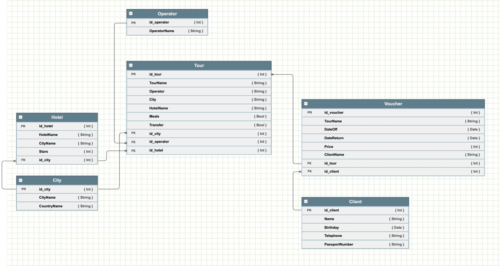

# ToursDB | *Приложение для тур-агенства* 

Tour App представляет собой приложение, позволяющее локально хранить данные и совершать 4 базовые операции над ними, а именно: Создание, Чтение, Редактирование и Удаление (CRUD). 

## Особенности
- В БД реализовано 5 типов объектов: Клиент, Город, Отель, Тур и Ваучер
- Объекты логически связи между объектами (1-many)
- Любые изменения и удаления отражаются на связанных объектах
- Удобное и интуитивно понятное создание и редактирование
- Удаление свайпом
- Возможность выбора вложенных данных с помощью UIPickerView

#### Cхема базы данных

## Технологии

ToursDB использует:
- Swift 5, Xcode 11
- Realm.io -- объектно-ориентированная база данных
- Cocoapods.org -- для подключения сторонних библиотек

## Лицензия
Только для ознакомления
2020

